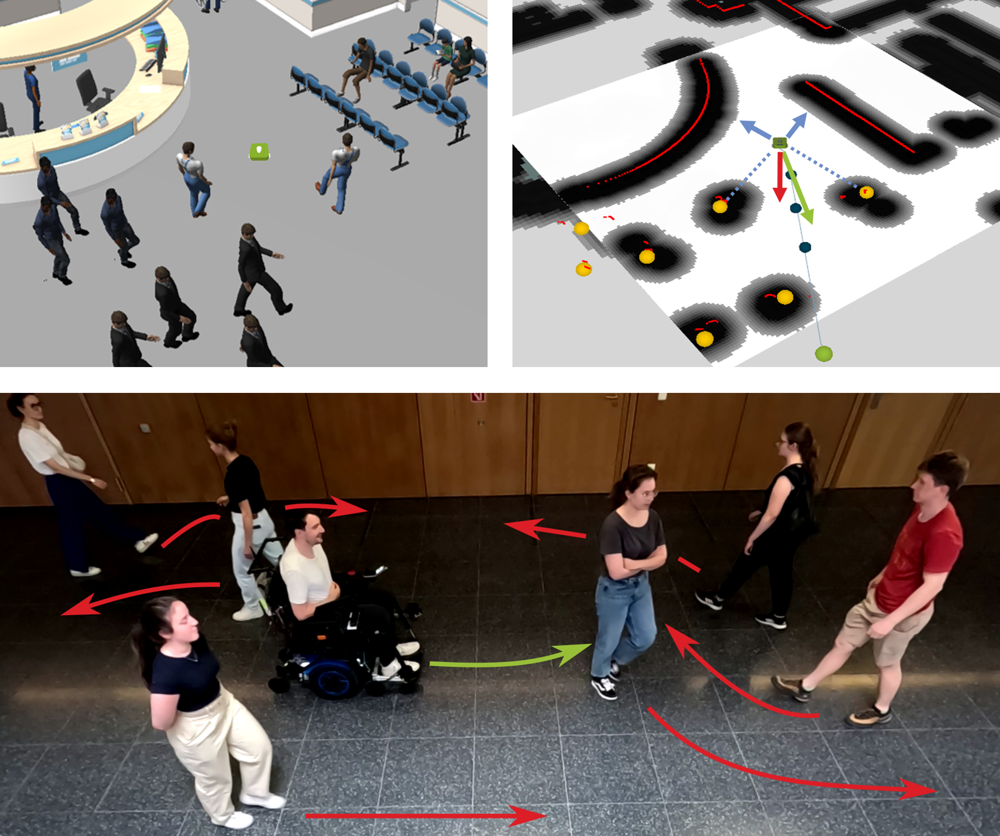

# DRL-SFM: Learning Social Navigation from Costmaps and Social Forces for Mobile Robots and Intelligent Wheelchairs



Implementation of our paper **"DRL-SFM: Learning Social Navigation from Costmaps and Social Forces for Mobile Robots and Intelligent Wheelchairs"**. This repository provides the full DRL-SFM training pipeline, the pre-trained model used in our evaluation, and a social navigation benchmark built on [HuNavSim](https://github.com/robotics-upo/hunav_sim) to allow full reproducibility of our results.

[](https://youtu.be/-_ZDtEr17gA)

## Key Features
- **Full training pipeline** — modular RL training with configurable launchers ([start_trainings.py](./hunav_rl/start_trainings.py))
- **Pre-trained model** — includes the model from our paper for direct evaluation and benchmark reproduction
- **Reproducible benchmark** — parallel evaluation across multiple simulated worlds powered by [HuNavSim](https://github.com/robotics-upo/hunav_sim) ([start_multiple_evaluations.py](./hunav_rl/start_multiple_evaluations.py))
- **Nav2 integration** — generic RL-based local planner plugin ([nav2_rl_controller](./nav2_rl_controller/)) with `geometry_msgs/Twist` action interface ([CalcTwist.action](./nav2_rl_controller_msgs/action/CalcTwist.action))

## Dependencies

Requires **ROS 2 Humble** on Ubuntu 22.04 and a **CUDA-capable GPU with CUDA installed** (required for PyTorch). All other dependencies are installed automatically by [install.sh](./install.sh) (including ROS 2 Humble itself if not already present).

**ROS 2 packages** (via apt):
- `ros-humble-gazebo-ros-pkgs`, `ros-humble-navigation2`, `ros-humble-nav2-bringup`
- `ros-humble-turtlebot3-gazebo`, `ros-humble-rtabmap*`, `ros-humble-tf-transformations`

**Python packages** (via pip):
- `stable-baselines3`, `sb3-contrib`, `tensorboard`, `numpy<2`, `torch`, `torchvision`, `torchaudio`

**Source dependencies** (cloned automatically):
- [people](https://github.com/wg-perception/people/tree/ros2) — people detection messages
- [hunav_sim](https://github.com/Kalemat96/hunav_sim) — custom fork of [robotics-upo/hunav_sim](https://github.com/robotics-upo/hunav_sim)
- [hunav_gazebo_wrapper](https://github.com/Kalemat96/hunav_gazebo_wrapper) — custom fork of [robotics-upo/hunav_gazebo_wrapper](https://github.com/robotics-upo/hunav_gazebo_wrapper)
- [aws-robomaker-hospital-world](https://github.com/aws-robotics/aws-robomaker-hospital-world) — hospital simulation world
- [aws-robomaker-small-house-world](https://github.com/aws-robotics/aws-robomaker-small-house-world) — small house simulation world
- [lightsfm](https://github.com/robotics-upo/lightsfm) — Social Force Model library (built from source)

## Installation

Clone this repository into the `src` folder of your ROS 2 workspace, then run the install script:

```bash
mkdir -p ~/your_ws/src && cd ~/your_ws/src
git clone https://github.com/FAU-FAPS/DRL-SFM.git
cd DRL-SFM
bash install.sh
```

## Usage

All scripts are located in the `hunav_rl` subdirectory:

```bash
cd <your_ws>/src/DRL-SFM/hunav_rl
```

### Training
Launch a training session (requires the private fork features for full logging):

```bash
python3 start_trainings.py
```

### Parallel Evaluation Across Multiple Worlds
Run evaluation of one or several trained policies in parallel simulated worlds:

```bash
python3 start_multiple_evaluations.py
```

The script runs every combination of world × people count × planner sequentially. Results are saved in `drl-sfm/hunav_rl/evaluation/<world>_<people>_<planner>/`.

**What to evaluate** — edit the three lists at the top of the script:

| Variable | Description |
|---|---|
| `worlds` | Gazebo environments to use (`"small_hospital"`, `"small_house"`) |
| `people_counts` | Number of pedestrians per run (e.g. `[5, 10, 15]`) |
| `planners` | Navigation policies to evaluate — comment/uncomment entries to enable or disable them |

**Scalar parameters:**

| Variable | Default | Description |
|---|---|---|
| `num_evaluations` | `100` | Number of episodes per combination |
| `num_simulations` | `1` | Number of parallel Gazebo instances |
| `first_ros_domain_id` | `60` | Starting ROS domain ID; each parallel instance gets an incremented ID to avoid topic collisions |
| `use_gzclient` | `True` | Show the Gazebo GUI; set to `False` for headless/faster runs |

**Auto-restart on failure:** the script monitors the output folder and automatically re-launches `start_evaluation.py` if a run crashes before all episodes complete. If something goes wrong, just wait — no manual intervention is needed. Combinations whose output folder is already complete are skipped automatically, so restarting the script after an interruption is safe.

### Generating New Evaluation Paths

Pre-generated paths are stored as pickle files in `hunav_rl/eval_paths/`:
- `eval_paths_small_hospital.pkl`
- `eval_paths_small_house.pkl`

These are loaded automatically during evaluation to ensure reproducibility across planners. If you want to generate a fresh set of paths (e.g. for a new world), delete or rename the corresponding `.pkl` file — the evaluation will regenerate it automatically on the next run using Nav2's path planner.

The path generation parameters are defined in `create_paths()` inside [hunav_rl/hunav_rl/eval.py](./hunav_rl/hunav_rl/eval.py):

| Parameter | Default | Description |
|---|---|---|
| `min_target_distance` | `7.0 m` | Minimum straight-line distance between start and goal |
| `min_ped_distance` | `2.0 m` | Minimum distance from the start position to any pedestrian |

Each generated path entry stores the robot start pose, goal position, and the full global path computed by Nav2. The robot is only spawned at positions with `x ≤ −7` or `x ≥ 7` (opposite sides of the crowd area) to ensure cross-navigation scenarios.

## Citation

If you use this work, please cite:

```bibtex
@inproceedings{kalenberg2026drlsfm,
  title={DRL-SFM: Learning Social Navigation from Costmaps and Social Forces for Mobile Robots and Intelligent Wheelchairs},
  author={Kalenberg, Matthias and Probst, Kilian and Gründer, Andreas and May, Christopher and Walter, Jonas and Franke, Jörg},
  booktitle={2026 IEEE International Conference on Robotics and Automation (ICRA)},
  year={2026},
  organization={IEEE}
}
```
